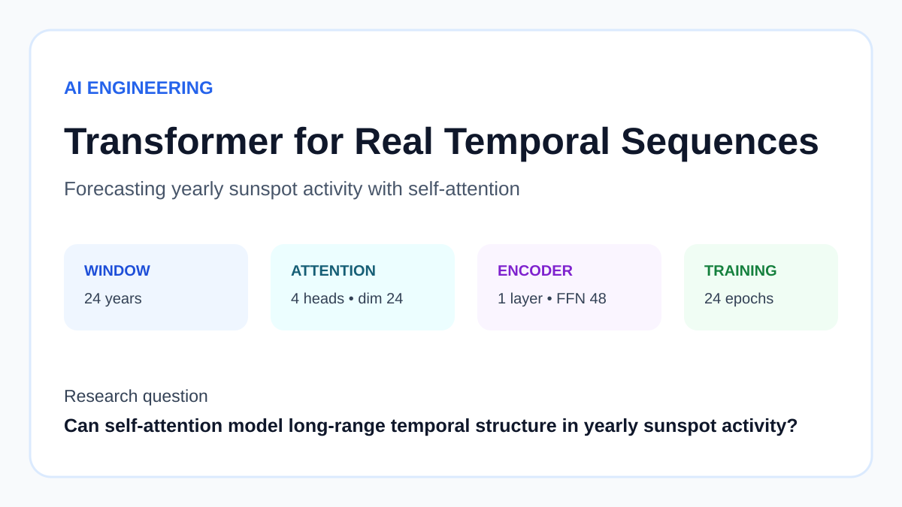
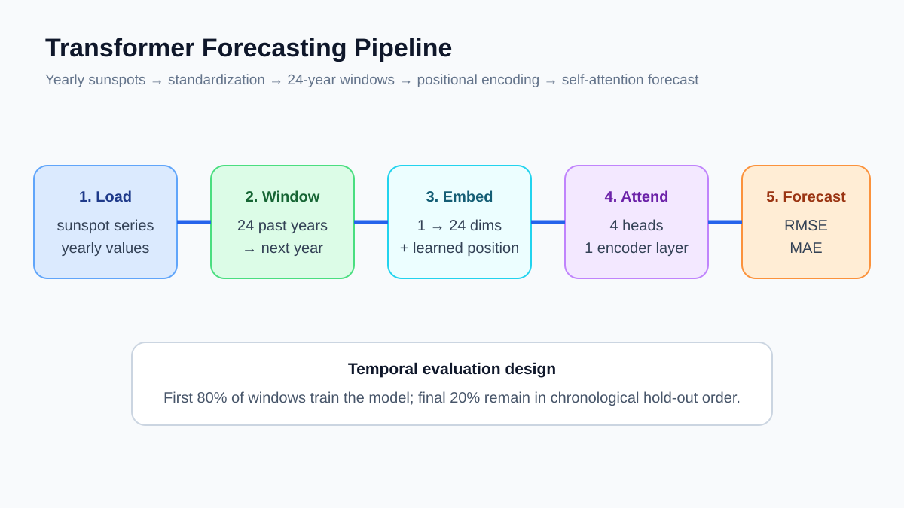
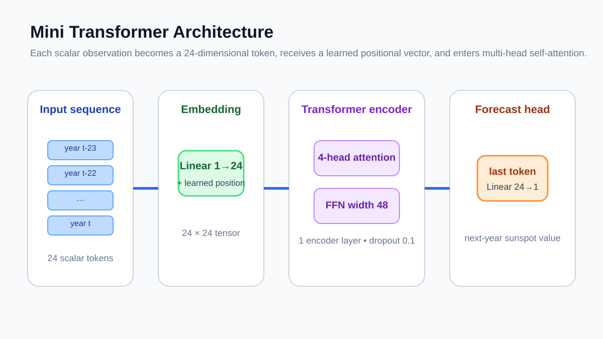
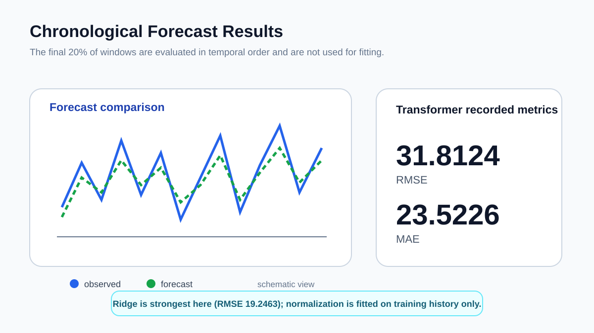

# Portfolio Summary

## Transformer Forecasting for Sunspot Activity

I use a compact Transformer encoder to forecast the next yearly sunspot value from the previous 24 years.

The model uses 24-dimensional token embeddings, learned positions, four attention heads, and one encoder layer. The split is chronological and normalization is fitted on the training period only.

### Images

**Key result:** RMSE 33.2499 and MAE 23.8058 on 57 held-out windows after the preprocessing fix.
