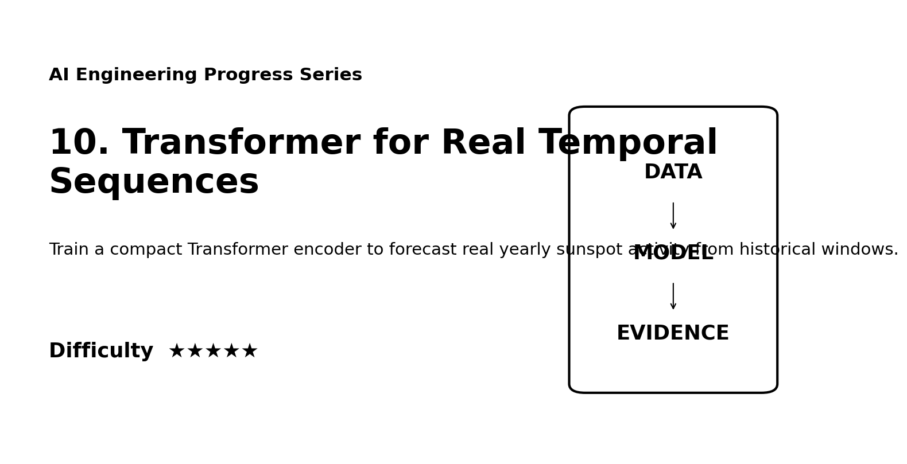
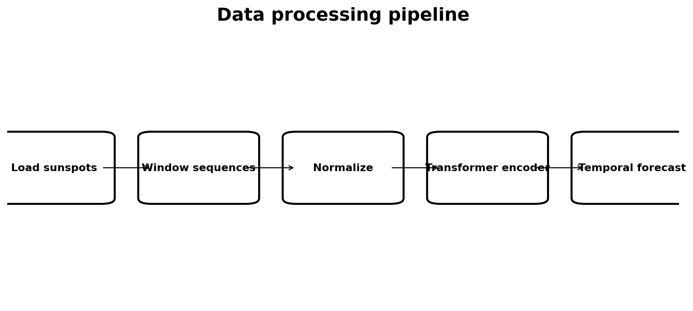
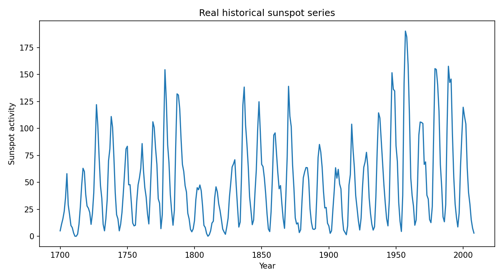
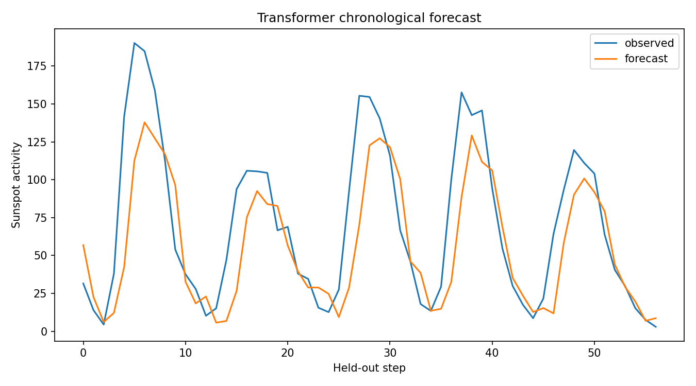

# 10. Transformer for Real Temporal Sequences ★★★★★



> **Quick description:** Train a compact Transformer encoder to forecast real yearly sunspot activity from historical windows.

## Why this project matters
Professor-readable AI Engineering evidence using **real data**, explicit processing, executable code, empirical or reproducible evaluation, and a scientific-style report. Core skills: **Transformers, self-attention, time series, PyTorch**.

## Dataset
- **Dataset:** Sunspots dataset via statsmodels
- **Reference:** https://www.statsmodels.org/stable/datasets/generated/sunspots.html
- See [`DATA.md`](DATA.md).

## Processing pipeline


## Evidence gallery
| Data / model | Evaluation / results |
|---|---|
|  |  |

## Reproduce
```bash
python -m venv .venv
source .venv/bin/activate   # Windows: .venv\Scripts\activate
pip install -r requirements.txt
python src/run_experiment.py
```

## Generated metrics
```json
{
  "rmse": 33.0650634765625,
  "mae": 23.189212799072266,
  "window_years": 24,
  "n_windows": 285
}
```

## Documentation
[`paper/paper.md`](paper/paper.md) · [`PORTFOLIO.md`](PORTFOLIO.md) · [`REPRODUCIBILITY.md`](REPRODUCIBILITY.md) · [`ETHICS.md`](ETHICS.md) · [`CITATION.cff`](CITATION.cff)

## Difficulty
**★★★★★**

## Integrity
This is a research portfolio report, not a peer-reviewed publication. Numerical claims should match `results/metrics.json` generated by the included code.
