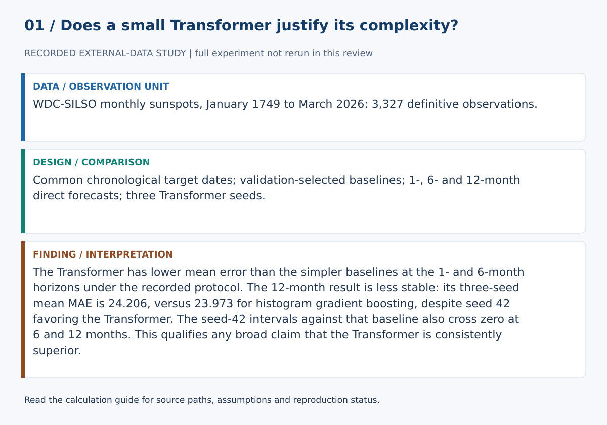
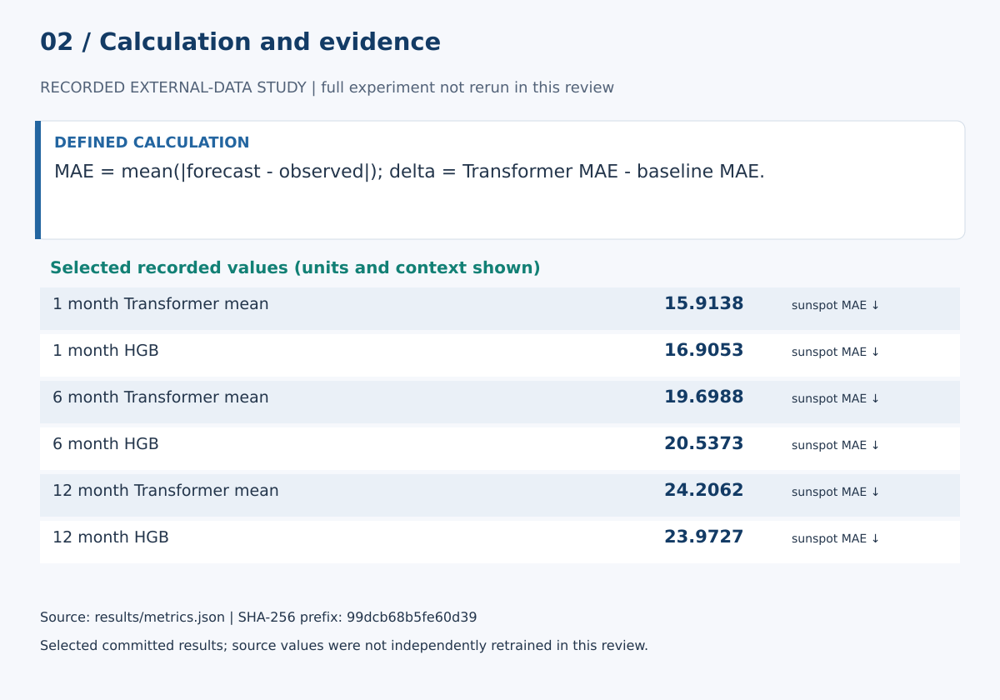

# Do Compact Transformers Beat Strong Baselines on Monthly Sunspot Forecasting?

## Abstract

Complex sequence models are often evaluated against weak baselines, a single horizon, or subtly different evaluation eras. This study tests a compact Transformer on the official WDC-SILSO Version 2.0 monthly Sunspot Number series against persistence, seasonal-naive, ridge and histogram-gradient-boosting forecasts at 1-, 6-, and 12-month horizons. The study freezes its scientific input through March 2026, reuses identical target-date boundaries across horizon and context comparisons, fixes positional encoding so context length does not alter trainable model size, and evaluates repeated seeds, moving-block bootstrap error differences, high-activity errors and early/late test-era robustness.

## Research question

Does a compact Transformer earn its complexity over strong simple and tabular baselines at 1-, 6-, and 12-month horizons, and are any apparent advantages robust to seed, activity regime, evaluation era and context length?

## Data

The source is WDC-SILSO's monthly mean total Sunspot Number Version 2.0, DOI `10.24414/qnza-ac80`, under CC BY-NC 4.0. The upstream service is living, so this bundle freezes the model input to definitive observations from January 1749 through March 2026. A deterministic SHA-256 over the month/value sequence prevents historical study-input drift while allowing later upstream rows to exist without changing this paper.

## Forecast design

One pair of validation/test target boundaries is computed from the frozen raw timeline and reused across all 1-, 6-, and 12-month horizons. The same boundaries are reused for horizon-1 context sensitivity at 60, 132 and 264 months. Scaling uses only values available through the final training target. Evaluation is rolling-origin direct forecasting with observed history: later test targets may use earlier realized observations as context, but never future observations or the target itself.

## Baselines

Persistence and 12-month seasonal naive provide transparent time-series references. Ridge autoregression provides a linear high-dimensional baseline. Histogram gradient boosting provides a nonlinear non-neural baseline. Ridge alpha and a small HGB configuration grid are selected using the same chronological validation era and validation-MSE criterion used for Transformer checkpoint selection. HGB internal random early stopping is disabled so it does not create an unreported random validation split.

## Transformer

The compact Transformer uses a 32-dimensional input projection, four attention heads, feed-forward width 64 and one encoder layer. Positional information uses fixed sinusoidal encoding rather than learned per-position parameters, preventing context-length comparisons from changing the trainable parameter count. Training uses validation-based early stopping and seeds 13, 42 and 73.

## Evaluation

MAE and RMSE are reported at all horizons. Transformer-versus-baseline MAE differences use a 12-month moving-block bootstrap against persistence, seasonal naive, ridge and HGB. The primary seed is reported for continuity, but every declared Transformer seed receives the same paired comparison and the manuscript reports across-seed delta mean/SD plus how many seeds favor the Transformer. This prevents one favorable optimization seed from standing in for seed-invariant evidence. Errors are also separated retrospectively into high-activity versus other periods and into early versus late halves of the common test era. The high-activity group is defined from the realized test outcome relative to a training-era threshold and is an error-analysis diagnostic, not a forecast-time feature. Context sensitivity uses the same maximum Transformer epoch cap and early-stopping policy as the primary study.

## Results

Generated evidence is written to `paper/results.md`, `paper/results.tex`, `results/summary.md` and `results/metrics.json`. Numerical values are generated by the runner rather than manually copied into the manuscript.

Across all three Transformer seeds, the Transformer has lower MAE than HGB at the 1-month and 6-month horizons. The 12-month comparison is materially less stable: two of three seeds outperform HGB, but the mean Transformer-minus-HGB MAE difference across seeds is +0.233 with an across-seed SD of 2.965. Thus the 12-month evidence does not support a seed-invariant Transformer advantage over HGB. The stronger conclusion is horizon-dependent: the compact Transformer is consistently competitive at shorter horizons, while the longest-horizon comparison is sensitive to optimization seed.

## Limitations

This is not a physical model of the Sun and is not validated for operational space-weather decisions. The historical series is cyclic and nonstationary, bootstrap summaries remain assumption-dependent, and any model advantage is specific to this frozen study era, protocol and model set.

## References

- Clette, F., & Lefèvre, L. (2015). *SILSO Sunspot Number V2.0*. WDC SILSO, Royal Observatory of Belgium. DOI: 10.24414/qnza-ac80.
- Clette, F., & Lefèvre, L. (2016). The New Sunspot Number: Assembling All Corrections. *Solar Physics*, 291, 2629–2651. DOI: 10.1007/s11207-016-1014-y.
- Vaswani, A., et al. (2017). Attention Is All You Need. *Advances in Neural Information Processing Systems*, 30.

## Calculation definitions and evidence audit

MAE = mean(|forecast - observed|); delta = Transformer MAE - baseline MAE.

Negative paired MAE differences favor the Transformer. Twelve-month moving blocks retain some serial dependence. Later test predictions may use already observed test-era history; this is rolling-origin forecasting, not one fixed-origin recursive forecast.

The Transformer has lower mean error than the simpler baselines at the 1- and 6-month horizons under the recorded protocol. The 12-month result is less stable: its three-seed mean MAE is 24.206, versus 23.973 for histogram gradient boosting, despite seed 42 favoring the Transformer. The seed-42 intervals against that baseline also cross zero at 6 and 12 months. This qualifies any broad claim that the Transformer is consistently superior.

The [calculation guide](../CALCULATIONS.md) provides exact evidence paths and a function-level implementation map.

### Selected evidence and interpretation

| Quantity | Value | Unit / meaning | JSON path |
|---|---:|---|---|
| 1 month Transformer mean | 15.913768871410474 | sunspot MAE ↓ | `horizons.1.metrics.transformer_repeated_seed_summary.mae_mean` |
| 1 month HGB | 16.90527831823438 | sunspot MAE ↓ | `horizons.1.metrics.hist_gradient_boosting.mae` |
| 6 month Transformer mean | 19.69880894688634 | sunspot MAE ↓ | `horizons.6.metrics.transformer_repeated_seed_summary.mae_mean` |
| 6 month HGB | 20.537293415179263 | sunspot MAE ↓ | `horizons.6.metrics.hist_gradient_boosting.mae` |
| 12 month Transformer mean | 24.206205192390268 | sunspot MAE ↓ | `horizons.12.metrics.transformer_repeated_seed_summary.mae_mean` |
| 12 month HGB | 23.97272047251438 | sunspot MAE ↓ | `horizons.12.metrics.hist_gradient_boosting.mae` |

These values are read from `results/metrics.json`. They must be interpreted with the split, data status and limitations above. The complete data/model experiment was not rerun in this review. Stored empirical results were inspected, not independently reproduced from raw data.

### Reproduction and claim boundaries

The existing suite requires unavailable dependencies; no full-suite pass is claimed. The figure generator can be checked with `python scripts/build_review_figures.py --check`. This verifies the displayed calculation evidence, not an independent replication of the complete scientific experiment. The manuscript is a working report, not a peer-reviewed publication.
